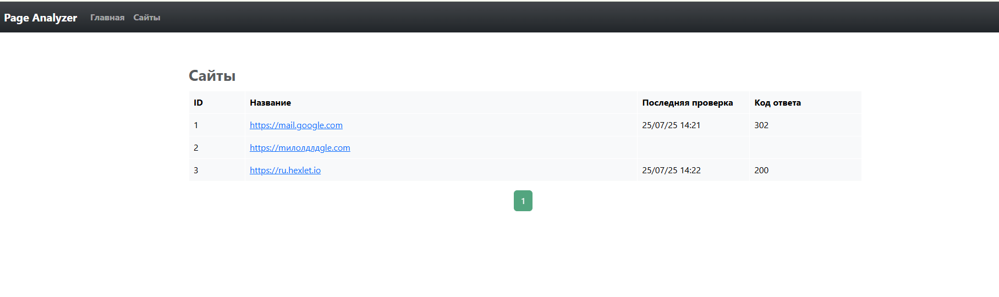
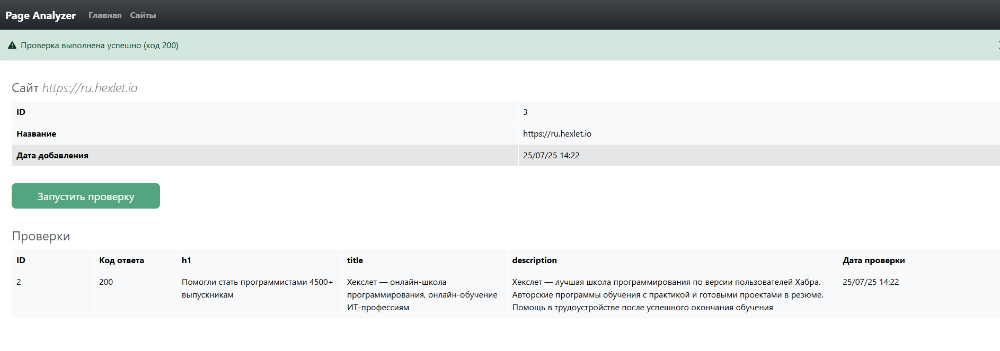
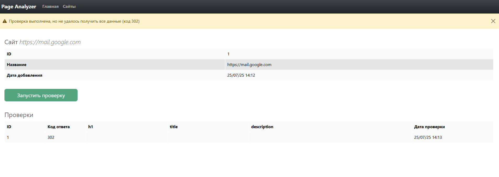
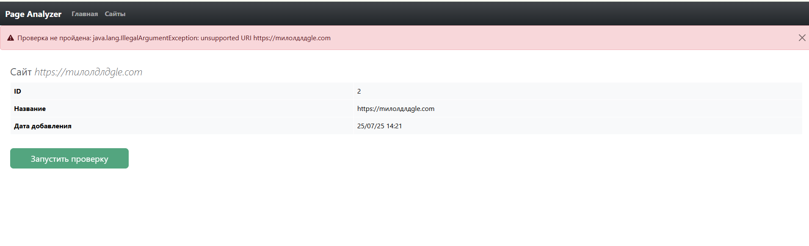

# Page Analyzer — Анализатор страниц


[](https://qlty.sh/gh/irinakomarchenko/projects/java-project-72)

## О проекте

Page Analyzer — это учебный проект на Java + Javalin, показывающий классическую MVC-архитектуру, работу с HTTP, шаблонами JTE, подключение к БД (H2, PostgreSQL), тестирование и автоматический деплой через Render.

## Возможности

- Добавление и хранение URL-адресов в базе
- Анализ SEO-параметров страниц (`title`, `h1`, `meta description`)
- Ручной запуск и история проверок для каждой страницы
- Пагинация, валидация форм, flash-сообщения
- Современное оформление на Bootstrap 5

## Технологии

- Java 21
- Gradle
- Javalin (бэкенд)
- JTE (шаблонизатор)
- HikariCP (пул соединений)
- H2 (dev) / PostgreSQL (production)
- Jsoup, Unirest (парсинг HTML и HTTP-запросы)
- Bootstrap 5
- Render (PaaS-деплой)
- JUnit, MockMvc (тесты)

## Запуск проекта локально

```sh
git clone https://github.com/irinakomarchenko/java-project-72.git
cd java-project-72/app
./gradlew build
./gradlew run
```
## Структура проекта
```sh
app/
├── src/main/java/hexlet/code/
│   ├── controller/
│   ├── dto/
│   ├── model/
│   ├── repository/
│   └── util/
├── src/main/resources/
│   ├── templates/
│   └── schema.sql
├── src/test/java/hexlet/code/
```


## 🚀 Деплой на Render

[🌐 Открыть деплой](https://java-project-72-55ck.onrender.com)

## Пример работы
[Смотреть видео на YouTube](https://youtu.be/bHulXUoTi-8)

### Вывод списка страниц и их статусов




